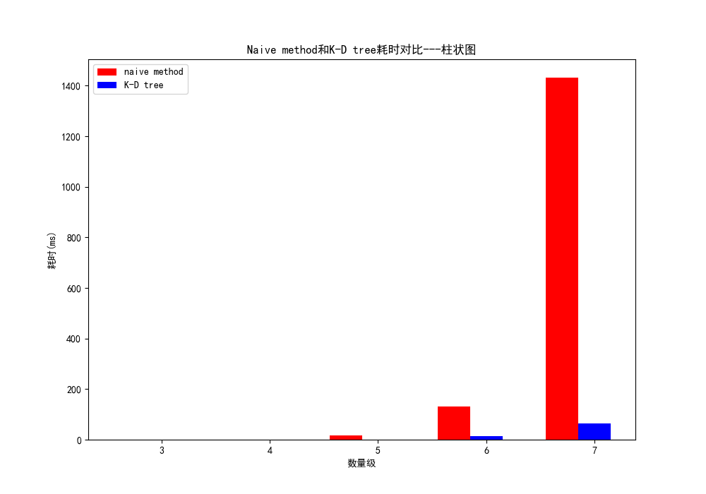

# KD-Tree

KD-Tree (K维树的缩写)是一种空间划分数据结构，用于组织k维空间中的点。

KD-Tree是机器学习领域经常用到的数据结构，最大的用处是可以在单次查询中获得距离样本最近的若干个样本。

在这个项目中，我们只考虑二维的点。

## KD-Tree的构建

insert()函数

1．初始化分割轴：
-策略1：从数据方差最大的轴开始分割。
-策略2：从数据范围最大的轴开始分割。
-简化处理，本项目中初始分割轴为 x 轴。
2. 选择当前轴数据的中位数，确定当前节点。
3. 根据节点划分双支数据（左子树数据小于当前节点，右子树大于）。
4. 更新分割轴。
5. 步骤2~4循环。

## 范围检索

range()函数

给定一个矩形区域，检索位于该区域内的所有点。

以二维为例。

1.	确定区域的范围，(xmin, ymin), (xmax, ymax)。
2.	先从 x 轴开始查询：
-当前节点的 x 坐标小于 xmin，说明需要查询右子树。
-当前节点的 x 坐标大于 xmax，说明需要查询左子树。
-不是以上情况，说明当前节点可能在区域内（还需要判断 y 轴），需要查询所有子树。
3. 查询 y 轴，与 x 轴操作类似。
4. 步骤2~3循环。

## 最近邻检索

search_nearest()函数

这里实现最简单的一个最近邻，快速定位到与目标节点最接近的点。

先从 x 轴开始检索。

1.	计算目标节点与当前节点的距离，如果小于当前的最小距离，则对其进行修改并更新相应的最近节点。
2.	目标节点在分割轴的哪一侧，就检索该侧的子树。
3.	计算目标节点与分割轴的距离，如果目标节点与分割轴的距离小于目前的最小距离，说明在另一侧子树中可能存在更小距离，否则不检索另一侧子树。
4.	步骤1~3循环，检索时需要更新分割轴。

## 测试

直接检索的算法复杂度为O(n)，使用 KD-Tree 检索的算法复杂度为O(log(N))。

